<div align="center">

<h1>anokiX Trader — Android</h1>

**The retail side of the anokiX B2B commerce platform, built natively for Android.**

Buy stock from distributor catalogues, receive and return goods, track shop inventory,
sell over a built-in POS with barcode scanning, and manage cash and rewards.

[](#)
[-3DDC84?style=flat-square)](#)
[](#)
[](#)
[](#)
[](LICENSE)

<br>

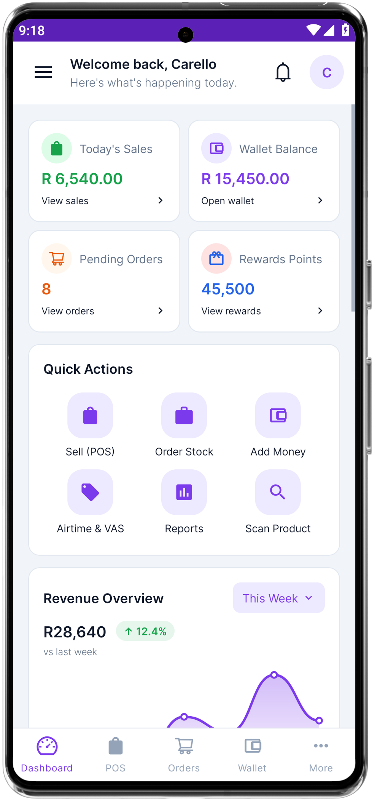
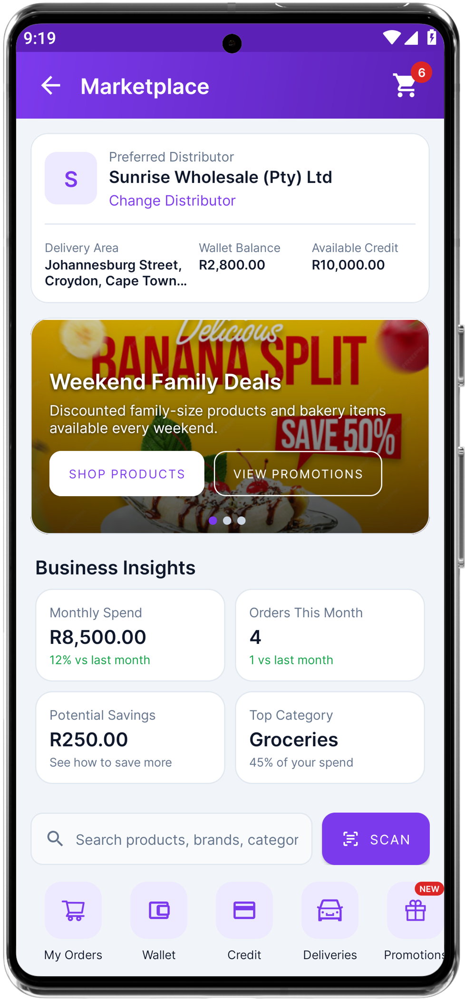
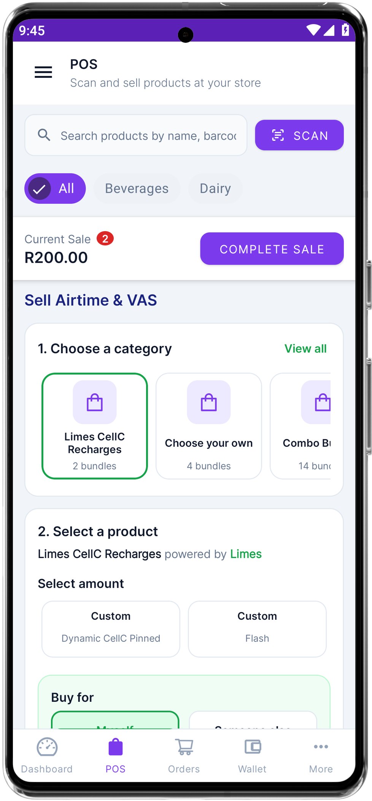
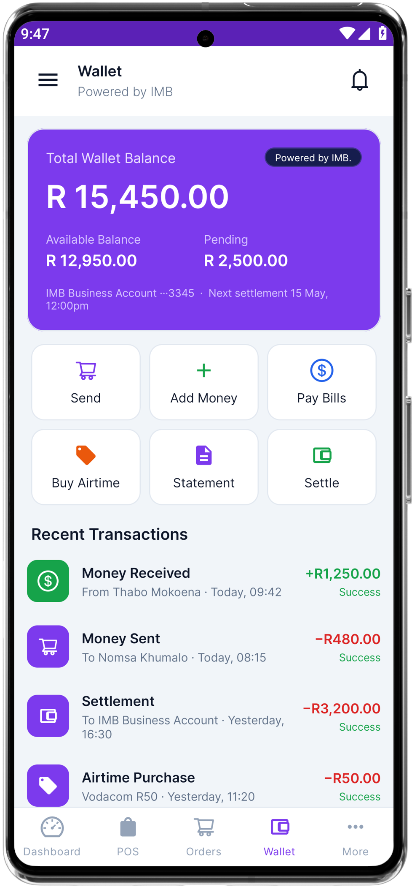

</div>

---

## About

anokiX connects **distributors** (wholesale suppliers) with **traders** (retail shops). This is the trader's app — built around a shop owner's day: restock from the marketplace, sell over the counter, and watch the cash.

It is one of four native apps in the platform: a Distributor and a Trader app, each built separately for Android and iOS against one shared REST API. The iOS counterpart is a deliberate port of this app — same screens, same API contract, same design language.

> [!NOTE]
> **The backend API is currently offline.** This repository is published as a reference for the app's **UI and user flows** — every screenshot below is a real capture from the running app, served by the bundled mock data. To run against live data, point it at your own backend and supply your own keys (see [Configuration](#configuration)).

---

## Screens and flows

### Sign in and get oriented

Welcome → login → a dashboard built for a shopkeeper: today's sales, wallet balance, pending orders and rewards points, then quick actions (Sell, Order Stock, Add Money, Airtime, Reports, Scan), a weekly sales curve, top sellers and low-stock alerts. A left drawer reaches every module.

<table>
<tr>
<td>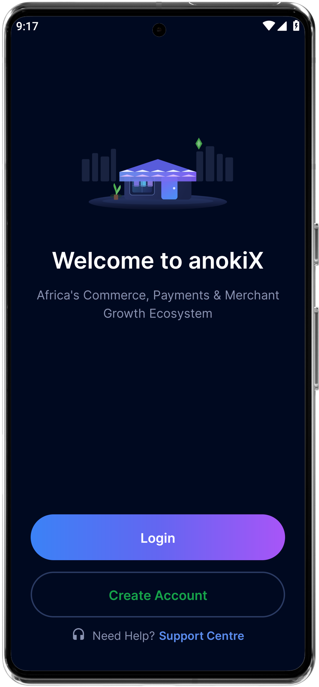</td>
<td>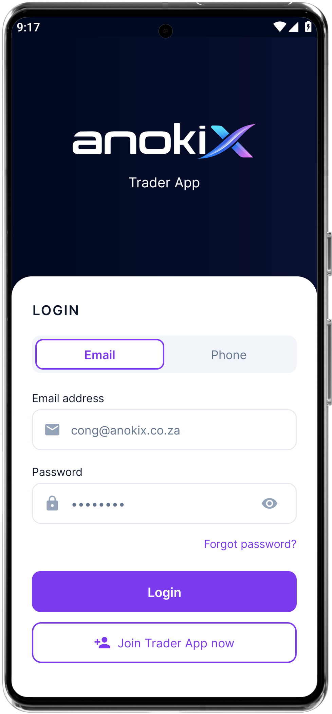</td>
<td></td>
<td>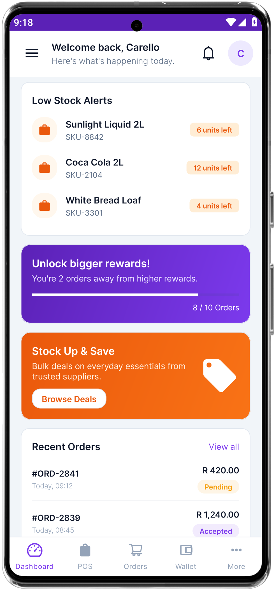</td>
<td>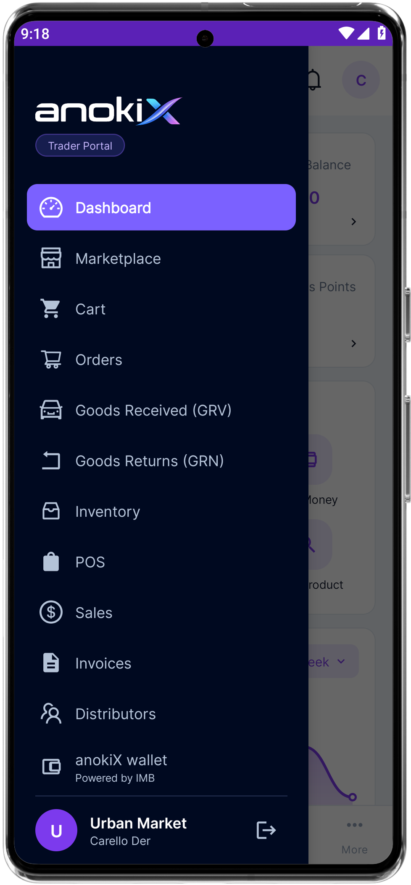</td>
</tr>
<tr>
<td align="center"><sub>Welcome</sub></td>
<td align="center"><sub>Login</sub></td>
<td align="center"><sub>Dashboard</sub></td>
<td align="center"><sub>Top sellers &amp; low stock</sub></td>
<td align="center"><sub>Drawer</sub></td>
</tr>
</table>

### Restocking flow

The marketplace opens on the preferred distributor with wallet balance and available credit, then promo banners, spend insights, categories and best sellers. Add to cart, place the order, and follow it through the same tracking timeline the distributor drives.

<table>
<tr>
<td></td>
<td>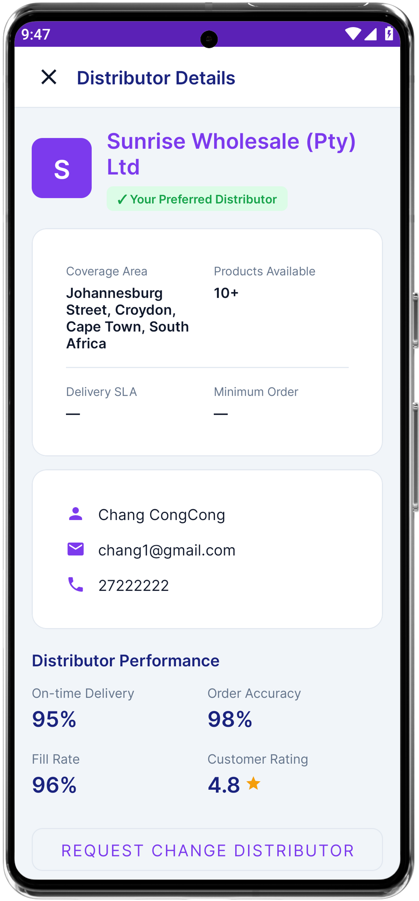</td>
<td>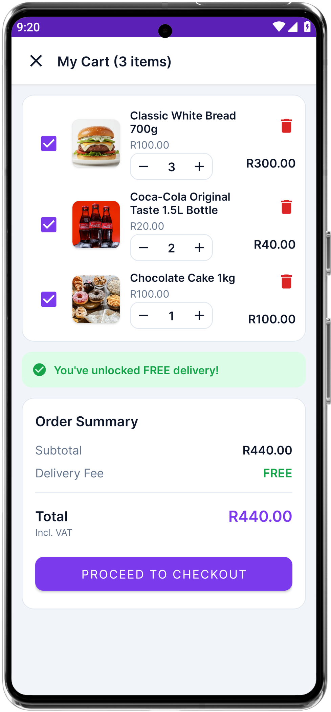</td>
<td>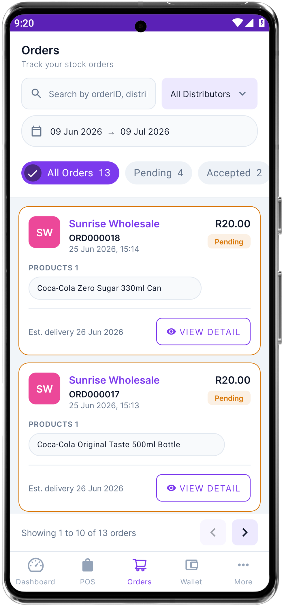</td>
<td>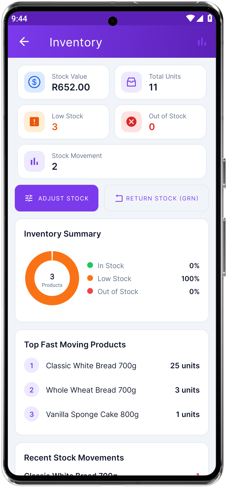</td>
</tr>
<tr>
<td align="center"><sub>Marketplace</sub></td>
<td align="center"><sub>Distributor</sub></td>
<td align="center"><sub>Cart</sub></td>
<td align="center"><sub>Orders</sub></td>
<td align="center"><sub>Inventory</sub></td>
</tr>
</table>

### Selling flow — the built-in POS

The POS is a till. Search or **scan a barcode** — CameraX drives the preview and frame analysis, ML Kit decodes, and the *bundled* barcode model is deliberate so the till scans the moment it opens with no first-run download. Tap products into the current sale, then check out with discount, VAT and payment method. The same screen sells **airtime and VAS**, showing your commission before you confirm.

<table>
<tr>
<td></td>
<td>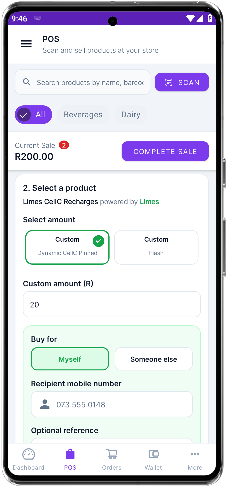</td>
<td>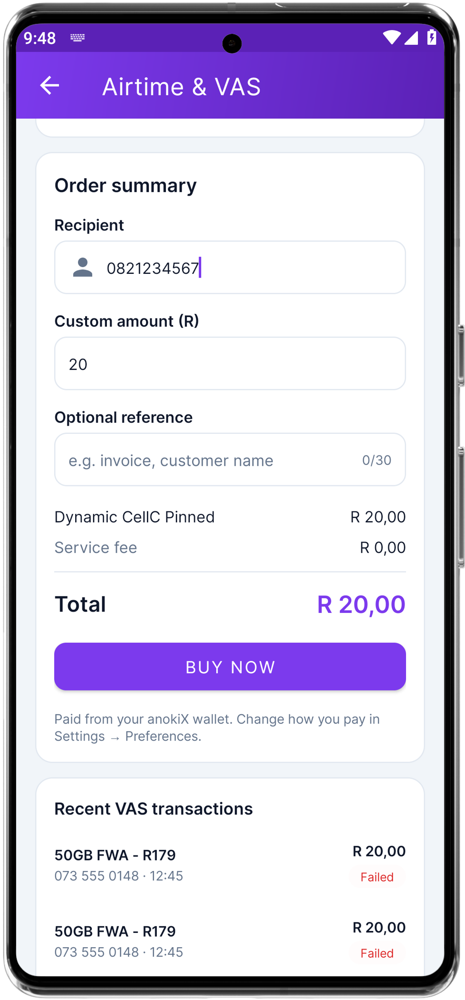</td>
<td></td>
<td>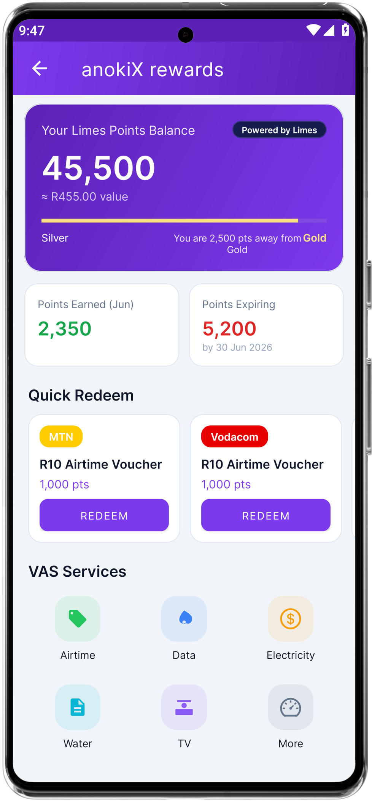</td>
</tr>
<tr>
<td align="center"><sub>POS</sub></td>
<td align="center"><sub>Sell airtime</sub></td>
<td align="center"><sub>Airtime &amp; VAS</sub></td>
<td align="center"><sub>Wallet</sub></td>
<td align="center"><sub>Rewards</sub></td>
</tr>
</table>

### Insight and reporting

Analytics covers revenue trends, category mix, a business health score and actionable insights. Reports generates sales, POS, inventory, marketplace, wallet and rewards exports, with recent reports listed for re-download.

<table>
<tr>
<td>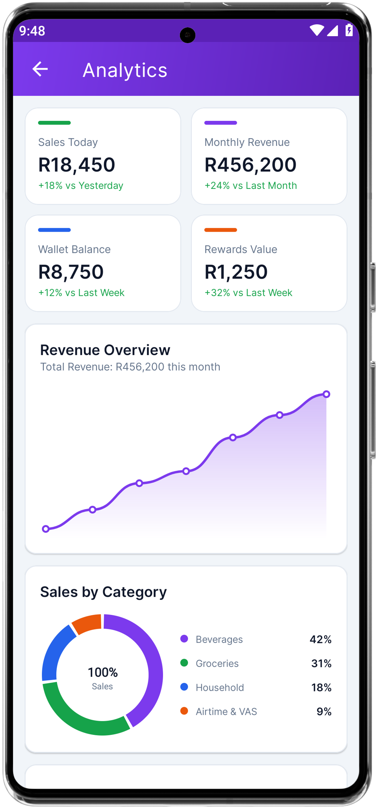</td>
<td>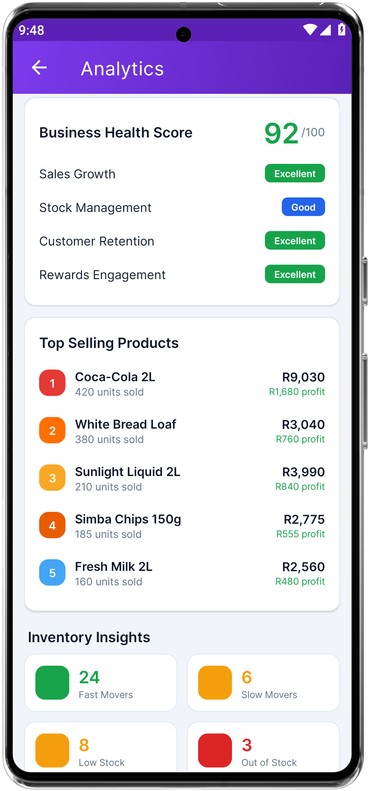</td>
<td>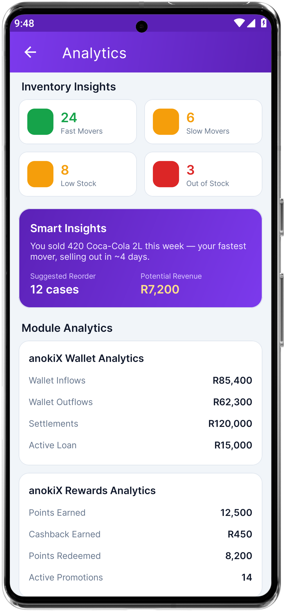</td>
<td>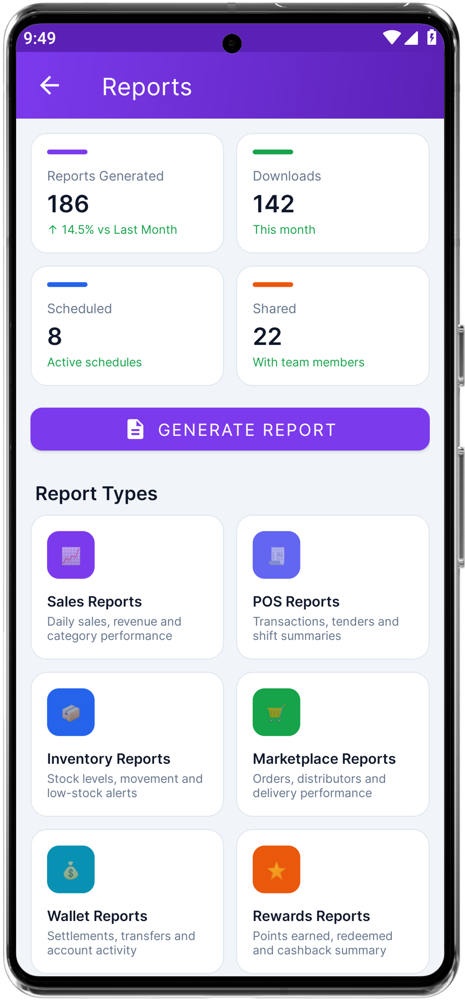</td>
<td>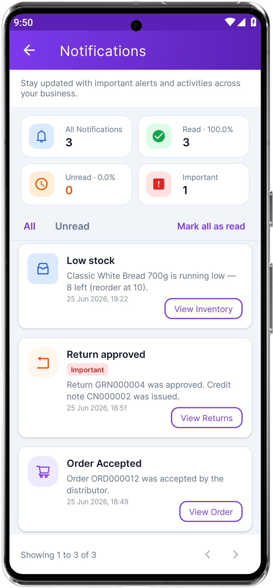</td>
</tr>
<tr>
<td align="center"><sub>Analytics</sub></td>
<td align="center"><sub>Health score</sub></td>
<td align="center"><sub>Insights</sub></td>
<td align="center"><sub>Reports</sub></td>
<td align="center"><sub>Notifications</sub></td>
</tr>
</table>

<details>
<summary><b>All 23 screens</b></summary>

<br>

<table>
<tr>
<td></td>
<td></td>
<td></td>
<td>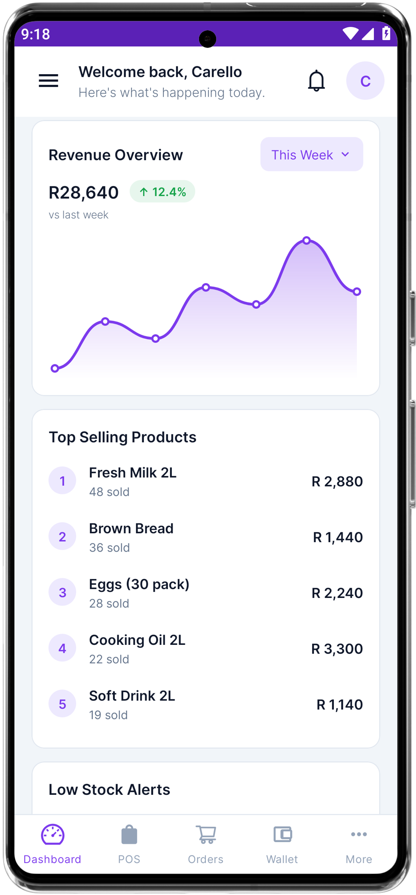</td>
<td></td>
<td></td>
</tr>
<tr>
<td align="center"><sub>Welcome</sub></td><td align="center"><sub>Login</sub></td><td align="center"><sub>Dashboard</sub></td><td align="center"><sub>Revenue</sub></td><td align="center"><sub>Low stock</sub></td><td align="center"><sub>Drawer</sub></td>
</tr>
<tr>
<td></td>
<td></td>
<td></td>
<td></td>
<td></td>
<td></td>
</tr>
<tr>
<td align="center"><sub>Marketplace</sub></td><td align="center"><sub>Cart</sub></td><td align="center"><sub>Orders</sub></td><td align="center"><sub>Inventory</sub></td><td align="center"><sub>POS</sub></td><td align="center"><sub>POS airtime</sub></td>
</tr>
<tr>
<td></td>
<td></td>
<td></td>
<td></td>
<td></td>
<td></td>
</tr>
<tr>
<td align="center"><sub>Distributor</sub></td><td align="center"><sub>Wallet</sub></td><td align="center"><sub>Rewards</sub></td><td align="center"><sub>Airtime &amp; VAS</sub></td><td align="center"><sub>Analytics</sub></td><td align="center"><sub>Health score</sub></td>
</tr>
<tr>
<td></td>
<td></td>
<td>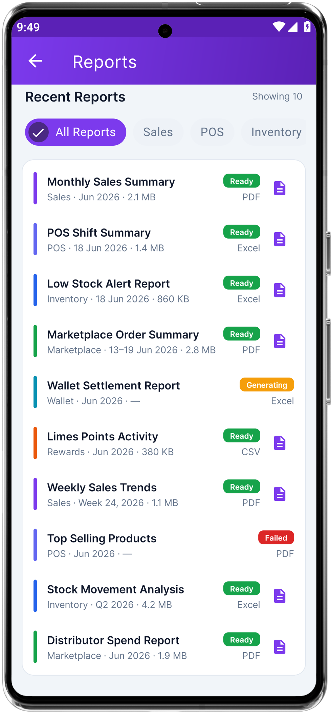</td>
<td>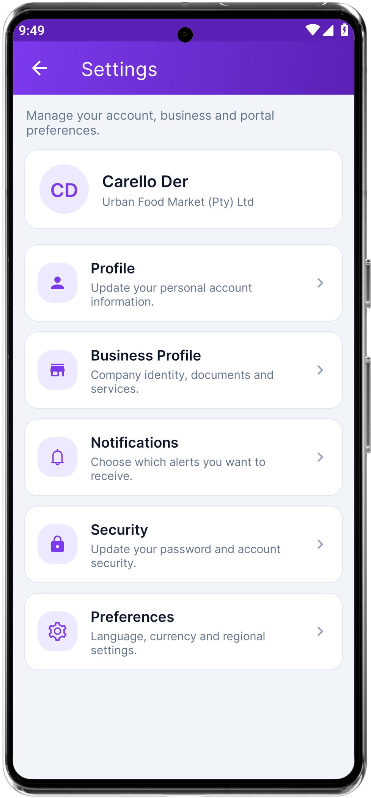</td>
<td></td>
<td></td>
</tr>
<tr>
<td align="center"><sub>Insights</sub></td><td align="center"><sub>Reports</sub></td><td align="center"><sub>Recent reports</sub></td><td align="center"><sub>Settings</sub></td><td align="center"><sub>Notifications</sub></td><td></td>
</tr>
</table>

</details>

---

## Features

| Area | Capability |
| --- | --- |
| **Dashboard** | Sales KPIs, quick actions, weekly sales chart, top products, low-stock alerts |
| **Marketplace** | Browse distributors, categories, collections and promotions; cart and checkout with delivery slots |
| **Sell (POS)** | CameraX + ML Kit barcode scanning, cart, discount, VAT, payment method, receipt |
| **Orders** | Order history with a tracking timeline and purchase-order PDF |
| **Goods Received / Returns** | Confirm deliveries against orders (GRV); raise and track returns (GRN) |
| **Inventory** | Shop stock levels, filters, adjustments, stock history, inventory analytics |
| **Invoices &amp; Payments** | Invoice list with an in-app PDF viewer, payment records |
| **Wallet** | Balance, transactions, and card top-up via a PayCloud checkout in Chrome Custom Tabs |
| **Rewards** | Limes points balance, tier progress, vouchers, points activity |
| **Airtime / VAS** | Service catalogue, customers, subscriptions and dynamic services |
| **Analytics &amp; Reports** | Revenue trends, category breakdown, health score, exportable reports |
| **Customers &amp; Staff** | Customer book; staff accounts with their own till sign-in |
| **Settings &amp; Support** | Profile, business, security, preferences; ticketed support with WhatsApp hand-off |
| **Push** | Firebase Cloud Messaging, token registered on login and removed on logout |

---

## Tech stack

- **Java 17** · `minSdk 24` (Android 7.0) · `compileSdk` / `targetSdk 34`
- AndroidX **AppCompat**, **Material Components**, ConstraintLayout, RecyclerView, CardView, ViewPager2, SwipeRefreshLayout
- **OkHttp 4.12** + **Gson 2.10** — a hand-rolled `ApiClient` / `Http` pair rather than Retrofit, matching the backend's `{ status, message, data }` envelope
- **CameraX 1.3.4** + **ML Kit barcode-scanning 17.3** — POS scanner, bundled model so it works offline from the first launch
- **Media3 ExoPlayer 1.4** — banner and promotion video
- **AndroidX Browser 1.7** — the top-up checkout opens in Chrome Custom Tabs rather than a WebView, so the trader sees a real address bar and padlock while typing card details, and browser autofill and 3-D Secure work
- **Glide 4.16** images · **Firebase Cloud Messaging** (BoM 33.7) push · **Play Services Maps 18.2** address picker · **hbb20 CCP 2.7.3** country picker

### Permissions

`INTERNET`, `ACCESS_NETWORK_STATE`, `POST_NOTIFICATIONS` (Android 13+), `CAMERA` (POS scanner), `VIBRATE` (scan confirmation), `ACCESS_FINE_LOCATION` / `ACCESS_COARSE_LOCATION` (store address picker).

The manifest also declares Android 11+ `<queries>` for WhatsApp, CSV viewers, and dial / mail / share intents, so the Support Centre and Reports screens can resolve their handlers.

---

## Getting started

### Prerequisites

- Android Studio Hedgehog (2023.1.1) or newer
- JDK 17
- Android SDK 34

### Build

```bash
./gradlew assembleDebug       # macOS / Linux
gradlew.bat assembleDebug     # Windows
```

The APK lands in `app/build/outputs/apk/debug/app-debug.apk`.

To run from the IDE: **File → Open**, select this folder, wait for Gradle sync, then deploy to any API 24+ device or emulator. The POS scanner needs a physical device or an emulator with a virtual camera.

### Configuration

No credentials are committed — the files below are git-ignored so live keys never reach the repository. Supply your own before building:

| What | Where |
| --- | --- |
| API base URL | `ApiClient.BASE_URL` in `network/ApiClient.java` |
| Google Maps API key | `app/src/main/res/values/google_maps_api.xml` |
| Firebase / FCM | `app/google-services.json` |

```bash
# 1. Maps key — copy the template into place and edit it
cp google_maps_api.xml.example app/src/main/res/values/google_maps_api.xml

# 2. Firebase — download google-services.json from your Firebase project
#    (Project settings → Your apps → Android app "com.anokix.traderapp")
#    and drop it in app/
```

Create your own Firebase project and Google Cloud API key, enable **Maps SDK for Android**, and restrict the key to the `com.anokix.traderapp` package plus your signing SHA-1. The Gradle build applies the `com.google.gms.google-services` plugin, so **`app/google-services.json` must exist or the build will fail.**

---

## Project structure

```
app/src/main/java/com/anokix/traderapp/
├── data/          Repositories — API and mock implementations behind one interface
├── model/         Domain models and formatters
├── network/       ApiClient (typed endpoints) → Http (OkHttp transport) → dto/
├── session/       SessionManager — token persistence in SharedPreferences
├── messaging/     FCM service + PushManager (token register / unregister)
└── ui/            Activities and adapters
    └── wallet/    Wallet and top-up return handling
```

- **Auth** is a bearer token from `api/common/login`, persisted locally and attached to every later request. Registration can land in a *pending approval* state, rendered as its own screen.
- **`BaseActivity` / `BaseListActivity`** carry the shared chrome (drawer, headers, list scaffolding) so individual screens stay small.
- **Mock data** backs every screen when no API is reachable — which is how the captures above were produced.

---

## Related repositories

| App | Platform |
| --- | --- |
| anokiX Trader | Android *(this repo)* · iOS |
| anokiX Distributor | Android · iOS |

---

## Status

All screens are implemented; the app is at version 1.0.7 (versionCode 107). The backend API is offline, so the app currently runs against its bundled mock data.

## License

Released under the [MIT License](LICENSE).
